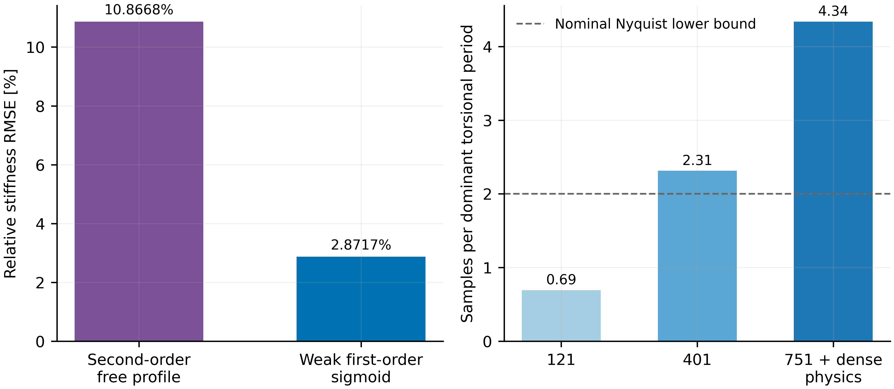

<div align="center">

# Physics-Informed Digital Twin for Torsional Stiffness Estimation

### Weak First-Order Physics-Informed Neural Network for Inverse Identification and Causal Monitoring of Time-Varying Torsional Stiffness

**Motor–Load Oscillatory Systems · Digital Twins · PINNs · Inverse Problems · Condition Monitoring**

[](https://github.com/poni0107/pinn-torsional-stiffness-digital-twin/actions/workflows/ci.yml)

</div>

---

## Research overview

This repository contains the research software, validated numerical results, reproducibility utilities, and publication-quality figures accompanying the study:

> **Digital Twin Design for Torsional Stiffness Estimation in Motor–Load Oscillatory Systems Using Physics-Informed Neural Networks**

The work addresses the **inverse identification of time-varying torsional stiffness** in a flexible two-inertia motor–load system.

The central idea is to combine available drivetrain information with governing mechanical equations so that a latent mechanical parameter — the torsional stiffness \(k(t)\) — can be reconstructed without using direct stiffness measurements as training targets.

The proposed framework follows the chain

$$
M_{em}(t),\ \omega_m(t),\ \omega_l(t)
\quad\longrightarrow\quad
\hat{\delta}(t),\ \hat{v}_{\delta}(t)
\quad\longrightarrow\quad
\text{weak physics constraints}
\quad\longrightarrow\quad
\hat{k}(t)
$$

and is evaluated under clean, noisy, reduced-supervision, sparse-sampling, baseline-comparison, and causal online conditions.

> [!NOTE]
> The present study is **simulation-validated**. The encoder responses are synthetic sensor signals generated by a reference ODE model. Experimental drivetrain validation remains future work.

---

## Main contributions

The repository implements and evaluates:

- a flexible two-inertia motor–load model with time-varying torsional stiffness;
- a `RelativeStateNet` for reconstruction of relative angular displacement and relative speed;
- a bounded monotone model for progressive stiffness degradation;
- a first-order physics-informed inverse formulation;
- weak integral kinematic and dynamic residuals;
- constant-stiffness control experiments;
- clean time-varying stiffness identification;
- robustness evaluation at 0.3% encoder-speed noise;
- reduced sensor-labelled supervision with dense physics collocation;
- analysis of sampling limitations;
- comparison with a conventional second-order baseline;
- causal online stiffness tracking;
- repeated computational-latency benchmarking;
- machine-readable result provenance;
- reproducible generation of publication tables and figures.

---

# Engineering problem

Flexible shafts, couplings, gears, and transmission elements can develop torsional oscillations when subjected to rapidly varying torque excitation.

Torsional stiffness is therefore both a structural parameter and a potentially useful indicator of mechanical condition.

A progressive decrease in effective torsional stiffness may indicate loss of mechanical integrity, coupling degradation, loosening, fatigue, or related deterioration.

However, direct time-resolved torsional-stiffness measurements are generally not available during ordinary system operation.

The problem is therefore formulated as an inverse identification task:

$$
\boxed{
M_{em}(t),\ \omega_m(t),\ \omega_l(t)
\rightarrow
\hat{k}(t)
}
$$

where:

- \(M_{em}(t)\) is the electromagnetic motor torque;
- \(\omega_m(t)\) is the motor-side angular velocity;
- \(\omega_l(t)\) is the load-side angular velocity;
- \(\hat{k}(t)\) is the estimated torsional stiffness.

---

# Data origin and study scope

The time vector \(t\) and electromagnetic-torque profile \(M_{em}(t)\) are provided by `jera1.mat`.

The motor- and load-side encoder-speed responses used in the present study are **synthetic sensor signals generated by the reference ODE model**.

They are not experimental vehicle measurements.

No direct stiffness or coupling-deformation measurement is supplied to the inverse estimator.

The reference stiffness trajectory is used only for evaluation and metric calculation; it is not used as a supervised stiffness target during PINN training or causal online updating.

`THref`, although available in the source MAT file, is intentionally excluded from the stiffness-identification loss.

Because redistribution rights for `jera1.mat` have not yet been confirmed, the dataset is **not distributed with this public repository**.

See [`data/README.md`](data/README.md) and [`docs/data_provenance.md`](docs/data_provenance.md) for details.

---

# Physical two-inertia motor–load model

The drivetrain is represented by an equivalent two-inertia mechanical system consisting of:

- motor inertia \(J_m\);
- load inertia \(J_l\);
- viscous torsional damping \(b_v\);
- time-varying torsional stiffness \(k(t)\);
- electromagnetic motor torque \(M_{em}(t)\).

The governing equations are

$$
\dot{\theta}_m=\omega_m
$$

$$
J_m\dot{\omega}_m
=
M_{em}
-
b_v(\omega_m-\omega_l)
-
k(t)(\theta_m-\theta_l)
$$

$$
\dot{\theta}_l=\omega_l
$$

$$
J_l\dot{\omega}_l
=
b_v(\omega_m-\omega_l)
+
k(t)(\theta_m-\theta_l).
$$

No independently varying external load torque is included in the present simulation study.

The relative torsional states are defined as

$$
\delta(t)=\theta_m(t)-\theta_l(t)
$$

and

$$
v_\delta(t)=\omega_m(t)-\omega_l(t).
$$

Defining

$$
\Gamma=
\frac{1}{J_m}
+
\frac{1}{J_l},
$$

the relative first-order dynamics become

$$
\dot{\delta}=v_\delta
$$

and

$$
\dot{v}_\delta
+
b_v\Gamma v_\delta
+
k(t)\Gamma\delta
-
\frac{M_{em}}{J_m}
=
0.
$$

A detailed derivation is provided in [`docs/equations.md`](docs/equations.md).

---

# Physics-informed inverse formulation

## Relative-state reconstruction

The proposed `RelativeStateNet` predicts

$$
\hat{\delta}(t)
\quad\text{and}\quad
\hat{v}_\delta(t).
$$

The first-order formulation avoids direct reliance on the second neural derivative

$$
\ddot{\delta},
$$

which can be particularly sensitive to approximation error in oscillatory inverse problems.

---

## Weak physics-informed residuals

Instead of enforcing the governing dynamics only through pointwise high-order derivatives, the proposed method imposes integral consistency over overlapping time windows

$$
[t_a,t_b].
$$

The weak kinematic residual is

$$
r_{\mathrm{kin}}
=
\hat{\delta}(t_b)
-
\hat{\delta}(t_a)
-
\int_{t_a}^{t_b}
\hat{v}_\delta(t)\,dt.
$$

The weak dynamic residual is

$$
r_{\mathrm{dyn}}
=
\hat{v}_\delta(t_b)
-
\hat{v}_\delta(t_a)
+
b_v\Gamma
\int_{t_a}^{t_b}
\hat{v}_\delta(t)\,dt
+
\Gamma
\int_{t_a}^{t_b}
\hat{k}(t)\hat{\delta}(t)\,dt
-
\frac{1}{J_m}
\int_{t_a}^{t_b}
M_{em}(t)\,dt.
$$

The complete objective combines data and physics information:

$$
\mathcal{L}_{\mathrm{total}}
=
\lambda_{\mathrm{data}}\mathcal{L}_{\mathrm{data}}
+
\lambda_{\mathrm{kin}}\mathcal{L}_{\mathrm{kin}}
+
\lambda_{\mathrm{dyn}}\mathcal{L}_{\mathrm{dyn}}
+
\lambda_{\mathrm{IC}}\mathcal{L}_{\mathrm{IC}}.
$$

The final offline weak formulation uses overlapping windows with:

- 101 points per window;
- stride 25;
- all valid overlapping windows.

Further methodological details are available in [`docs/methodology.md`](docs/methodology.md).

---

# Time-varying stiffness representation

The present study focuses on **progressive monotone stiffness degradation**.

The estimated stiffness is represented using a bounded smooth transition:

$$
\hat{k}(t)
=
k_{\mathrm{low}}
+
\frac{k_{\mathrm{high}}-k_{\mathrm{low}}}
{1+\exp\left(\frac{t-t_c}{w}\right)}.
$$

This parameterization introduces a physically interpretable prior and constrains the inverse problem to meaningful stiffness values.

The current formulation does **not** demonstrate arbitrary non-monotone stiffness recovery, intermittent faults, or multiple independent degradation events.

---

# Proposed architecture


The architecture separates four main components:

1. encoder-derived relative-state reconstruction;
2. bounded time-varying stiffness estimation;
3. data consistency;
4. weak physical consistency.

The true stiffness trajectory is not used as a supervised training target.

---

# Main results

## Constant-stiffness validation

Before considering time-varying degradation, the inverse formulation was evaluated for three constant reference stiffness values.

All experiments used the same initial estimate of

$$
288.75\ \mathrm{N\,m/rad}.
$$

| Reference stiffness [N·m/rad] | Estimated stiffness [N·m/rad] | Absolute error [N·m/rad] | Relative error |
|---:|---:|---:|---:|
| 350 | 351.2077 | 1.2077 | 0.3451% |
| 300 | 300.2400 | 0.2400 | 0.0800% |
| 245 | 245.2341 | 0.2341 | 0.0956% |

The maximum relative error across the three controlled cases is approximately **0.345%**.

These experiments provide a controlled verification of the inverse formulation before introducing a continuously varying stiffness trajectory.

---

## Time-varying stiffness identification

| Scenario | Sensor-labelled points | Physics-collocation points | Relative \(k\)-RMSE | \(R_k^2\) |
|---|---:|---:|---:|---:|
| Full-rate clean | 1501 | 1501 | **2.8717%** | **0.9524** |
| 0.3% encoder-speed noise | 1501 | 1501 | **2.9032%** | **0.9514** |
| Reduced sensor supervision | 751 | 1501 | **3.7483%** | **0.9190** |
| Second-order baseline | 1501 | 1501 | **10.8668%** | **0.3191** |

The clean full-rate experiment provides the strongest offline reconstruction.

The investigated 0.3% encoder-speed noise level causes only a small change in stiffness-estimation accuracy.

The weak first-order formulation also substantially outperforms the investigated conventional second-order baseline.


---

# Reduced sensor supervision

The reduced-supervision experiment uses

$$
751
$$

uniformly distributed sensor-labelled observations instead of

$$
1501.
$$

This corresponds to

$$
\frac{1501-751}{1501}\times100
=
49.97\%
$$

fewer sensor-labelled observations.

Importantly, all

$$
1501
$$

physics-collocation points are retained.

Therefore, the **49.97% reduction applies specifically to sensor-labelled supervision**.

It does not represent a 49.97% reduction in the physics-collocation grid or total computational workload.

The reduced-supervision configuration achieves

$$
\mathrm{relative}\ k\text{-RMSE}
=
3.7483\%
$$

with

$$
R_k^2
=
0.9190.
$$

The reconstructed relative states achieve approximately

$$
R_\delta^2=0.9243
$$

and

$$
R_{v_\delta}^2=0.8897.
$$

The results therefore show that the stiffness trajectory remains well reconstructed with substantially fewer labelled observations, while state reconstruction becomes more sensitive to the reduction in direct supervision.

---

# Sampling limitations

More aggressive uniform subsampling reveals the temporal-resolution limits of the inverse problem.

| Configuration | Sensor points | Samples per dominant torsional period | Relative \(k\)-RMSE | \(R_k^2\) | Interpretation |
|---|---:|---:|---:|---:|---|
| Reduced supervision + dense physics | 751 | 4.34 | 3.748% | 0.9190 | Reliable stiffness reconstruction |
| Uniform sparse sampling | 401 | 2.31 | 26.219% | -2.9640 | Insufficient temporal density for reliable inverse reconstruction |
| Strong undersampling | 121 | 0.69 | 28.354% | -3.6361 | Reconstruction strongly limited by aliasing |

The dominant torsional response is approximately in the **228–233 Hz** range.

The 401-point case is especially informative: a nominal Nyquist condition alone does not guarantee accurate physics-informed inverse reconstruction.

The weak integral formulation also requires adequate temporal resolution of the oscillatory dynamics.



---

# Causal near-real-time benchmark

A causal warm-started implementation was evaluated through repeated online stiffness updates.

The selected configuration uses **five Adam optimization steps per update** and was benchmarked over **10 independent timing repetitions**.

| Quantity | Value |
|---|---:|
| Adam steps/update | 5 |
| Repetitions | 10 |
| Measured updates | 290 |
| Computational target | 25.000 ms |
| Mean latency | **2.541 ms** |
| Median latency | **2.273 ms** |
| P95 latency | **4.031 ms** |
| P99 latency | **6.465 ms** |
| Maximum latency | **6.816 ms** |
| Updates above 25 ms | **0 / 290** |
| Relative online \(k\)-RMSE | **6.727%** |
| Online \(R_k^2\) | **0.7394** |
| Final stiffness error | **7.471%** |


The measured execution times demonstrate **causal near-real-time computational feasibility on the tested CPU configuration**.

They do **not** constitute hard-real-time certification or deterministic worst-case execution-time guarantees.

The causal implementation is warm-started using an offline-pretrained `RelativeStateNet`; therefore, online accuracy is reported separately from the full offline identification result.

---

## Degradation-threshold illustration

For an illustrative threshold of

$$
315\ \mathrm{N\,m/rad},
$$

the causal estimate crosses the threshold at approximately

$$
0.300\ \mathrm{s},
$$

while the reference degradation trajectory crosses it at approximately

$$
0.383896\ \mathrm{s}.
$$

The difference is approximately

$$
83.9\ \mathrm{ms}.
$$

This should be interpreted as **threshold-crossing behaviour of the estimator**, not as a guaranteed 83.9 ms prediction of a future physical fault.

Practical deployment would require additional persistence, uncertainty, and decision-logic mechanisms.

---

# Repository structure

```text
.
├── .github/
│   └── workflows/
│       └── ci.yml
│
├── configs/
│   ├── main_clean.toml
│   ├── noise_0p3pct.toml
│   ├── online_benchmark.toml
│   └── sparse751_dense_physics.toml
│
├── data/
│   └── README.md
│
├── docs/
│   ├── equations.md
│   ├── methodology.md
│   ├── experiments.md
│   ├── reproducibility.md
│   ├── data_provenance.md
│   ├── results_provenance.md
│   ├── limitations.md
│   └── figures_description.md
│
├── paper/
│   └── README.md
│
├── results/
│   ├── experiment_metrics/
│   ├── figures/
│   ├── provenance/
│   └── tables/
│
├── scripts/
│   ├── build_public_results.py
│   ├── generate_publication_figures.py
│   ├── run_online_adam_steps_comparison.py
│   └── run_repeated_online_latency.py
│
├── src/
│   ├── mvm_pinn_jera1.py
│   └── pinn_torsional_twin/
│       ├── __init__.py
│       ├── cli.py
│       ├── config.py
│       ├── data.py
│       ├── models.py
│       └── physics/
│
├── tests/
├── CITATION.cff
├── LICENSE
├── pyproject.toml
├── requirements.txt
└── requirements-reporting.txt
```

---

# Installation

Clone the repository:

```bash
git clone https://github.com/poni0107/pinn-torsional-stiffness-digital-twin.git
cd pinn-torsional-stiffness-digital-twin
```

Create a virtual environment:

```bash
python -m venv .venv
```

Activate it.

### Windows

```bash
.venv\Scripts\activate
```

### Linux / macOS

```bash
source .venv/bin/activate
```

Install the main dependencies:

```bash
pip install -r requirements.txt
```

For reporting and publication-figure generation:

```bash
pip install -r requirements-reporting.txt
```

---

# Local data setup

Because `jera1.mat` is not redistributed with the repository, place an authorized local copy at:

```text
data/jera1.mat
```

The expected MAT file contains:

- `t`
- `Mem`
- `THref`

Only `t` and `Mem` are used in the present stiffness-identification workflow.

See:

- [`data/README.md`](data/README.md)
- [`docs/data_provenance.md`](docs/data_provenance.md)

---

# Quick start

Inspect the command-line interface:

```bash
pinn-torsional-twin --help
```

Validate the main clean configuration without launching a long optimization:

```bash
pinn-torsional-twin run main_clean --dry-run
```

Additional scenarios:

```bash
pinn-torsional-twin run noise_0p3pct --dry-run
pinn-torsional-twin run sparse751_dense_physics --dry-run
pinn-torsional-twin run online_benchmark --dry-run
```

The legacy compatibility interface remains available:

```bash
python src/mvm_pinn_jera1.py --help
```

---

# Reproducing the public results

Validated public tables are generated from preserved machine-readable result artifacts:

```bash
python scripts/build_public_results.py
```

Verify source artifacts without rebuilding:

```bash
python scripts/build_public_results.py --check-only
```

Generate publication figures:

```bash
python scripts/generate_publication_figures.py
```

Verify all figure inputs:

```bash
python scripts/generate_publication_figures.py --check-only
```

Long neural-network retraining is **not required merely to inspect or regenerate the validated public tables and figures**.

---

# Result provenance

The reported scientific numbers are linked to preserved machine-readable artifacts.

Provenance information is available in:

- [`docs/results_provenance.md`](docs/results_provenance.md)
- [`results/provenance/README.md`](results/provenance/README.md)
- [`results/provenance/result_provenance.json`](results/provenance/result_provenance.json)

SHA-256 hashes are stored for validated result sources used to construct public tables and figures.

The public figure generator does not perform training or numerical optimization.

---

# Testing

Run the lightweight scientific regression tests:

```bash
python -m unittest discover -s tests -v
```

The test suite covers:

- MAT-file loading;
- exclusion of `THref`;
- deterministic synthetic measurement generation;
- two-inertia ODE consistency;
- reference stiffness generation;
- weak residual calculations;
- gradient propagation;
- physical stiffness constraints;
- modular/legacy model equivalence;
- configuration loading;
- CLI compatibility.

The modular implementation was validated against the legacy implementation with **zero numerical regression difference** in the tested deterministic calculations.

---

# Reproducibility

The repository intentionally distinguishes between:

- source/input data;
- synthetic reference-ODE sensor responses;
- trained-model outputs;
- public numerical result artifacts;
- generated figures;
- computational benchmarks;
- development-history records.

This distinction prevents simulation results from being misrepresented as experimental measurements.

For full details, see:

- [`docs/reproducibility.md`](docs/reproducibility.md)
- [`docs/data_provenance.md`](docs/data_provenance.md)
- [`docs/results_provenance.md`](docs/results_provenance.md)

---

# Limitations

The results should be interpreted within the following scope.

### Simulation-based validation

Motor- and load-side encoder responses are generated by the reference ODE model rather than measured on a physical drivetrain test bench.

### Known mechanical parameters

The present inverse formulation assumes that \(J_m\), \(J_l\), and \(b_v\) are known.

### Monotone degradation prior

The current stiffness representation is designed for bounded progressive degradation.

Arbitrary non-monotone recovery, intermittent behaviour, or multiple fault events have not been demonstrated.

### Reduced supervision does not mean reduced physics resolution

The 751-label experiment retains all 1501 physics-collocation points.

### Offline-pretrained relative-state model

The causal online estimator is warm-started using an offline-pretrained `RelativeStateNet`.

### No hard-real-time guarantee

The reported computational benchmark demonstrates near-real-time feasibility on the tested CPU configuration, not deterministic hard-real-time certification.

### External load disturbance

An independently varying external load torque is not included in the current formulation.

Future work should investigate robust or joint identification under unknown mechanical load disturbances.

### Experimental validation

Physical test-bench and hardware-in-the-loop validation remain necessary before conclusions can be generalized to real drivetrain deployment.

Further discussion is available in [`docs/limitations.md`](docs/limitations.md).

---

# Future research

The estimated stiffness trajectory provides an interpretable latent mechanical parameter that may support future research in:

- experimental drivetrain digital twins;
- condition monitoring;
- predictive-maintenance models;
- uncertainty-aware degradation assessment;
- remaining-useful-life estimation;
- adaptive vibration suppression;
- gain-scheduled control;
- model-predictive control;
- joint estimation of stiffness and unknown load disturbances;
- non-monotone degradation models;
- multiple-fault identification;
- hardware-in-the-loop and embedded implementation.

These are **future research directions**, not experimentally validated capabilities claimed by the present repository.

---

# Scientific integrity

The repository intentionally distinguishes between:

- simulation;
- synthetic sensor responses;
- learned model outputs;
- reference trajectories;
- computational benchmarks;
- experimental measurements.

The project does not claim:

- physical drivetrain validation where none was performed;
- measured encoder trajectories where synthetic responses were used;
- arbitrary sparse-data capability;
- hard-real-time certification;
- experimentally validated predictive maintenance;
- experimentally validated adaptive control.

This distinction is maintained throughout the code, documentation, public results, and provenance records.

---

# Citation

Citation metadata are provided in [`CITATION.cff`](CITATION.cff).

Bibliographic conference metadata will be updated after the final conference record becomes available.

If the repository is used before the final bibliographic record is available, please cite the repository together with the accompanying research manuscript.

---

# Authors

### Marijana Jeremić
University of Kragujevac, Serbia

### Lazar Krstić
University of Kragujevac, Serbia

### Miloš Ivanović
Faculty of Information Studies, Novo Mesto, Slovenia

### Mihailo Lazarević
University of Belgrade, Serbia

### Milan Matijević
University of Kragujevac, Serbia

---

# License

A permissive open-source software license has not yet been assigned.

The repository contains research software whose third-party provenance and redistribution conditions must be fully confirmed before a formal licensed release.

The dataset `jera1.mat` is not redistributed.

See [`LICENSE`](LICENSE) for the current repository status.

# ACKNOWLEDGMENTS

This research was supported by the Science Fund of the Republic of Serbia, Grant No. 214, within the project “Parametric and Nonparametric Methods for Data-Driven Optimal Control of Mechatronic Systems with Flexible Coupling - DDOC”. 

---

<div align="center">

**Physics-informed learning · inverse parameter identification · torsional dynamics · digital twins**

</div>
