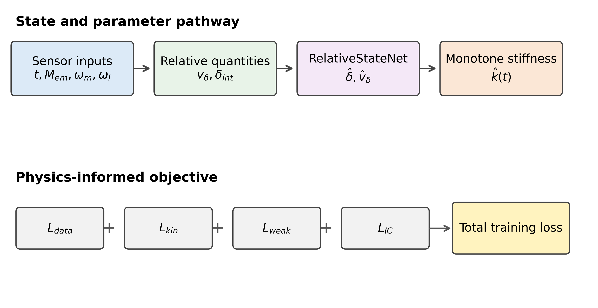
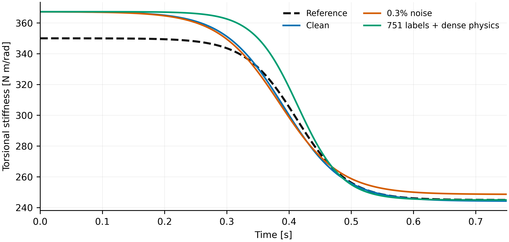
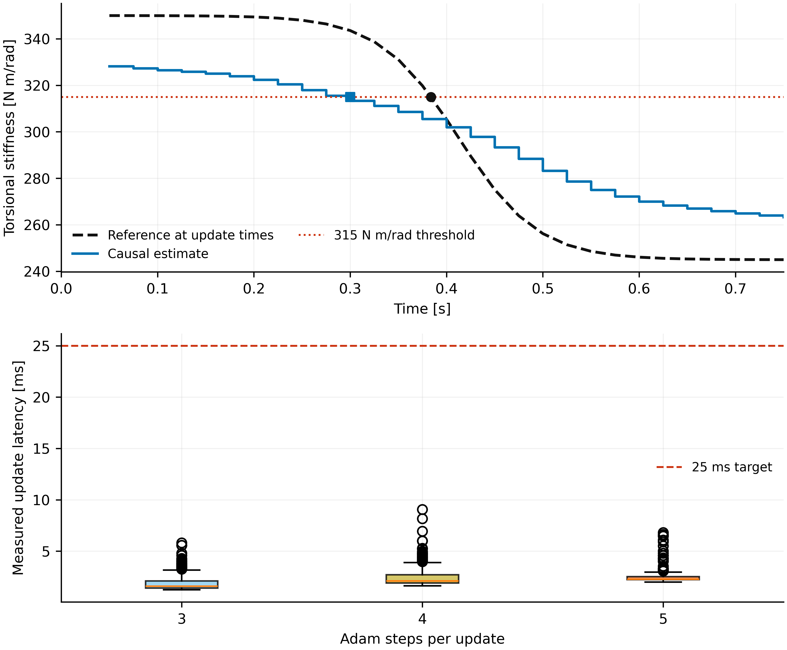

# Physics-informed digital twin for torsional-stiffness degradation

This repository implements a simulation-validated digital twin for estimating
time-varying torsional stiffness in a two-inertia motor-load system. The public
workflow is centered on

```text
electromagnetic torque + motor/load encoder speeds
    -> relative-state reconstruction
    -> weak first-order physics constraints
    -> inverse time-varying stiffness estimation
    -> causal degradation monitoring
```

In the simulation study, the available channels are recorded `t` and `Mem(t)`
plus synthetic ODE encoder-speed responses `omega_m(t)` and `omega_l(t)`;
`Jm`, `Jl`, and `bv` are known. `RelativeStateNet` is a time-coordinate network
trained to reconstruct `delta_hat(t)` and `v_delta_hat(t)` from encoder-derived
supervision, while a separate monotone four-parameter model estimates
`k_hat(t)`. Torque enters the weak dynamic residual rather than serving as a
direct `RelativeStateNet` input. The main contribution is this first-order
weak inverse formulation: it enforces kinematic and integrated dynamic
consistency without the unreliable second derivative that limited the retained
second-order baseline.



## What is measured and what is simulated

The local MATLAB input provides the recorded time coordinate `t` and
electromagnetic torque profile `Mem(t)`. `THref`, if present, is not used by the
PINN. Motor and load encoder-speed responses are synthetic sensor signals
obtained from the reference two-inertia ODE. This is therefore a simulation
validation driven by a recorded input profile, not an experimental drivetrain
validation.

The dataset is not redistributed because permission has not been confirmed.
See [data/README.md](data/README.md) for the required schema.

## Proposed formulation

With

```text
delta   = theta_m - theta_l
v_delta = omega_m - omega_l,
```

the network returns `delta_hat(t)` and `v_delta_hat(t)`. On every overlapping
window `[t_a, t_b]`, the weak dynamic residual is

```text
v_delta_hat(t_b) - v_delta_hat(t_a)
+ bv*(1/Jm + 1/Jl) * integral(v_delta_hat dt)
+ (1/Jm + 1/Jl) * integral(k_hat(t)*delta_hat(t) dt)
- (1/Jm) * integral(Mem(t) dt).
```

The proposed branch never evaluates `delta_ddot`. The stiffness model is

```text
k_hat(t) = k_low + (k_high-k_low)/(1+exp((t-t_center)/width)),
```

with physical bounds on both stiffness levels, transition center, and width.
Reference stiffness is excluded from loss construction, initialization, early
stopping, checkpoint selection, and online updates; it is used only for
post-training simulation metrics.

Full derivations are in [docs/equations.md](docs/equations.md) and the training
procedure is in [docs/methodology.md](docs/methodology.md).

## Validated results

### Constant-stiffness controls

All cases began from the same `288.75 N m/rad` initial estimate.

| Reference [N m/rad] | Estimate [N m/rad] | Relative error |
|---:|---:|---:|
| 350 | 351.2077 | 0.3451% |
| 300 | 300.2400 | 0.0800% |
| 245 | 245.2341 | 0.0956% |

### Time-varying degradation

| Scenario | Sensor labels | Physics points | Relative stiffness RMSE | Stiffness R² | Initial/final error |
|---|---:|---:|---:|---:|---:|
| Full-rate clean | 1501 | 1501 | 2.8717% | 0.9524 | 4.9128% / 0.2962% |
| 0.3% differential noise | 1501 | 1501 | 2.9032% | 0.9514 | 4.9226% / 1.4985% |
| 751 labels + dense physics | 751 | 1501 | 3.7483% | 0.9190 | 4.9436% / 0.0116% |

The reduced-supervision case removes 750 of 1501 sensor-labelled times, a
`49.97%` reduction in labelled supervision. It still uses all 1501 unlabeled
physics-collocation points, so this is not a 49.97% reduction in total
computation or physics evaluation. Its relative-angle reconstruction has
`R²=0.9243`; relative-speed reconstruction is weaker at `R²=0.8897`, which is
reported as an auxiliary state-reconstruction limitation rather than hidden.



### Baseline and sampling limits

The retained second-order free-profile baseline gives `10.8668%` relative
stiffness RMSE and `R²=0.3191`, compared with `2.8717%` and `R²=0.9524` for the
proposed clean weak first-order model.

Uniform 121-point sampling provides only `0.69` samples per dominant torsional
period and aliases the approximately `228-233 Hz` response band. Uniform
401-point sampling provides `2.31` samples per period; nominal Nyquist is met,
but state reconstruction and trapezoidal angle integration remain unreliable.
These experiments are retained as sampling limitations, not as successful
reduced-supervision results.

### Causal online benchmark

The final benchmark compares 3, 4, and 5 Adam steps per update over ten
repetitions each. The reported five-step configuration was selected after all
runs by the declared deadline/accuracy rule; reference stiffness never enters
an online update.

| Quantity | Final repeated benchmark |
|---|---:|
| Window / stride | 101 / 50 samples |
| Update period | 25.000 ms |
| Repetitions / timed updates | 10 / 290 |
| Mean / median latency | 2.541 / 2.273 ms |
| P95 / P99 latency | 4.031 / 6.465 ms |
| Maximum latency | 6.816 ms |
| Deadline exceedances | 0 / 290 |
| Online relative stiffness RMSE | 6.727% |
| Online stiffness R² | 0.7394 |
| Final stiffness error | 7.471% |

The 315 N m/rad threshold is triggered at `0.300 s`, approximately `83.9 ms`
before the reference crossing at `0.383896 s`. This is causal near-real-time
feasibility on the tested CPU, not hard-real-time certification.



## Repository layout

```text
configs/                    portable experiment definitions
data/                       input schema; private MAT data are ignored
docs/                       equations, methods, experiments, provenance, limits
results/experiment_metrics/ validated machine-readable metrics
results/tables/             raw and normalized public tables
results/figures/            generated PNG/PDF figures
results/provenance/         claim-to-artifact mapping and checksums
scripts/                    public result/figure builders and run wrappers
src/pinn_torsional_twin/    modular implementation
tests/                      deterministic lightweight regression tests
```

## Installation

Python 3.12 is recommended.

```bash
python -m venv .venv
```

Activate the environment with `.venv\Scripts\activate` on Windows or
`source .venv/bin/activate` on Linux/macOS, then run

```bash
python -m pip install --upgrade pip
python -m pip install -e .
```

## Reproducing public tables and figures

These commands do not train a network and do not require the private dataset:

```bash
python scripts/build_public_results.py
python scripts/generate_publication_figures.py
python -m unittest discover -s tests -v
```

Long experiment reproduction requires an authorized `data/jera1.mat` copy:

```bash
pinn-torsional-twin check-data --mat data/jera1.mat
pinn-torsional-twin run --config configs/main_clean.toml --mat data/jera1.mat
pinn-torsional-twin run --config configs/noise_0p3pct.toml --mat data/jera1.mat
pinn-torsional-twin run --config configs/sparse751_dense_physics.toml --mat data/jera1.mat
```

See [docs/reproducibility.md](docs/reproducibility.md) for staged commands,
expected outputs, and the online benchmark procedure.

## Scientific scope and limitations

The current evidence is limited to a two-inertia simulation with known `Jm`,
`Jl`, and `bv`; synthetic encoder responses; a bounded monotone stiffness
model; and one recorded torque profile. Experimental drivetrain validation,
independently varying external load torque, arbitrary non-monotone recovery,
multiple faults, and hard-real-time certification are outside the demonstrated
scope. The online estimator also relies on an offline-pretrained
`RelativeStateNet`.

The estimated degradation trajectory may support future predictive-maintenance
or adaptive-control research, but neither downstream application is implemented
or validated here.

Complete limitations are documented in [docs/limitations.md](docs/limitations.md).

## Citation and reuse status

Citation metadata are provided in [CITATION.cff](CITATION.cff) without a DOI or
claimed publication status. The manuscript is deliberately not included while
it remains under author revision.

No open-source license is currently granted. The existing [LICENSE](LICENSE)
status notice remains in force until the authors explicitly approve a software
license and third-party provenance is resolved.
